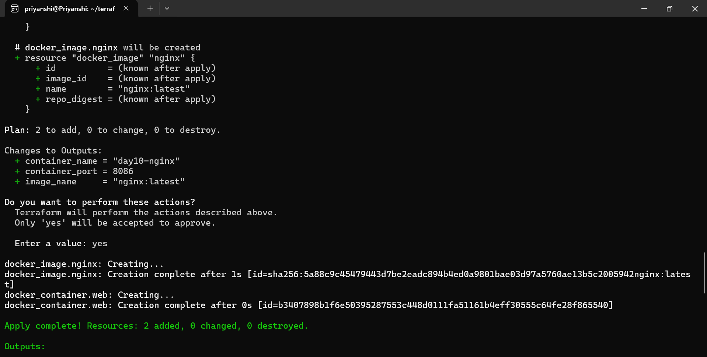
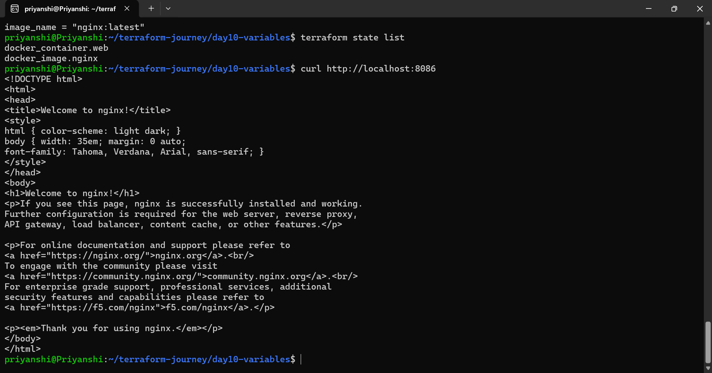

# Day 10 — Terraform Variables & Outputs

Today I continued my **Terraform learning journey** by working with **variables and outputs**.

This is an important step toward writing Terraform configurations that are reusable, configurable, and easier to maintain.

## 📌 What I Learned

### 1. Terraform Variables

Terraform variables allow values to be passed into a configuration instead of hardcoding them directly inside `.tf` files.

Example:

```hcl
variable "container_name" {
  description = "Name of the Docker container"
  type        = string
  default     = "terraform-web"
}
```

The variable can then be referenced using:

```hcl
var.container_name
```

### 2. Variable Types

Terraform supports different variable types, including:

* `string`
* `number`
* `bool`
* `list`
* `set`
* `map`
* `object`
* `tuple`

Using appropriate types makes configurations more predictable and maintainable.

### 3. Variable Values

Variables can be assigned values in different ways, including:

* Default values
* `terraform.tfvars`
* Command-line arguments
* Environment variables

For example:

```hcl
terraform apply -var="container_name=my-web"
```

### 4. Terraform Outputs

Outputs allow useful information from Terraform resources to be displayed after deployment.

Example:

```hcl
output "container_name" {
  value = docker_container.web.name
}
```

After applying the configuration, the output can be viewed using:

```bash
terraform output
```

## 🐳 Hands-on Practice

For this exercise, I used the **Docker provider** with Terraform to create and manage a Docker container.

The workflow was:

```text
Terraform Configuration
        ↓
Variables
        ↓
Terraform Plan
        ↓
Terraform Apply
        ↓
Docker Container
        ↓
Outputs
        ↓
Validation
```

## 🔎 Validation

I verified the Terraform deployment by checking the running container and accessing the application locally.

The screenshots in this directory show the Terraform execution and validation:

### Terraform Execution



### Application Validation



## 🧠 Key Takeaways

* Variables make Terraform configurations reusable.
* Variable types help enforce predictable inputs.
* Outputs make important resource information easy to retrieve.
* Terraform configurations become cleaner when values are separated from resource definitions.
* Combining variables and outputs is an important foundation for building scalable Infrastructure as Code.

## 🛠️ Tools Used

* Terraform
* Docker
* Docker Provider
* Ubuntu / WSL
* Git & GitHub

## 📚 Terraform Journey

**Day 10 completed ✅**

Continuing toward more advanced Terraform concepts and eventually applying them to real cloud infrastructure and DevOps workflows.
