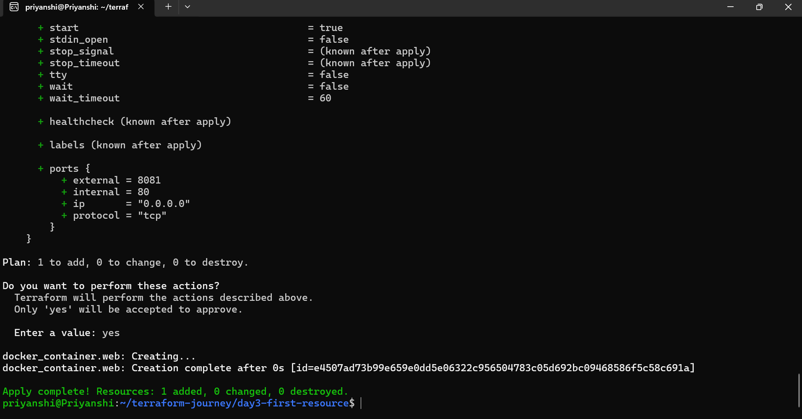
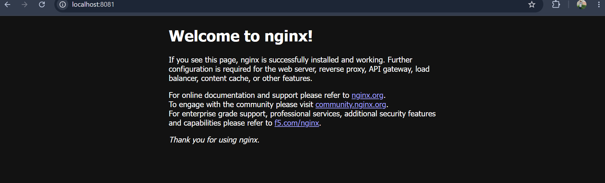
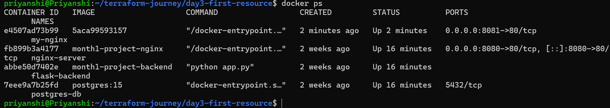

# Day 3 - First Infrastructure with Terraform

## Topics Learned

- terraform plan
- terraform apply
- docker provider
- docker_image resource
- docker_container resource
- port mapping

## Files

- main.tf
- notes.txt
- screenshots

## Architecture

Terraform
↓
Docker Provider
↓
Docker Engine
↓
Nginx Container

## Screenshots

### Terraform Apply

### Docker Container Running

### Nginx Running

## Key Learning

Infrastructure can be created and managed entirely through code.

Last updated: Day 3 - First Terraform Resource